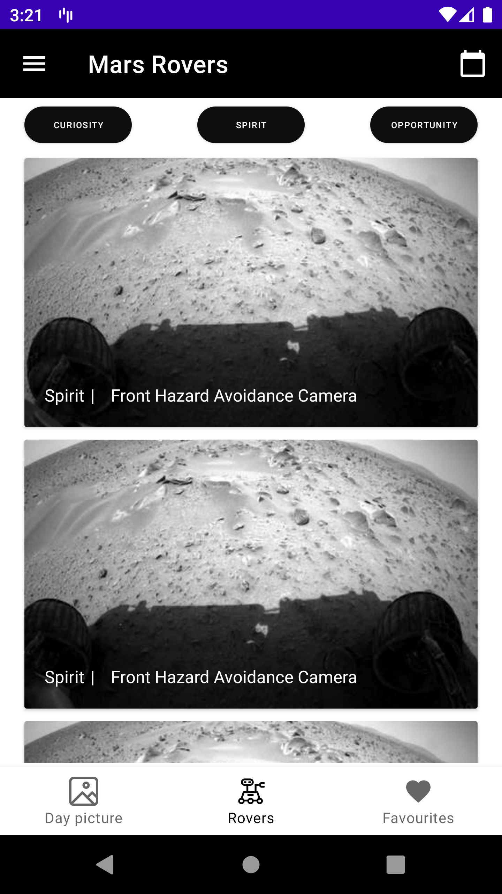
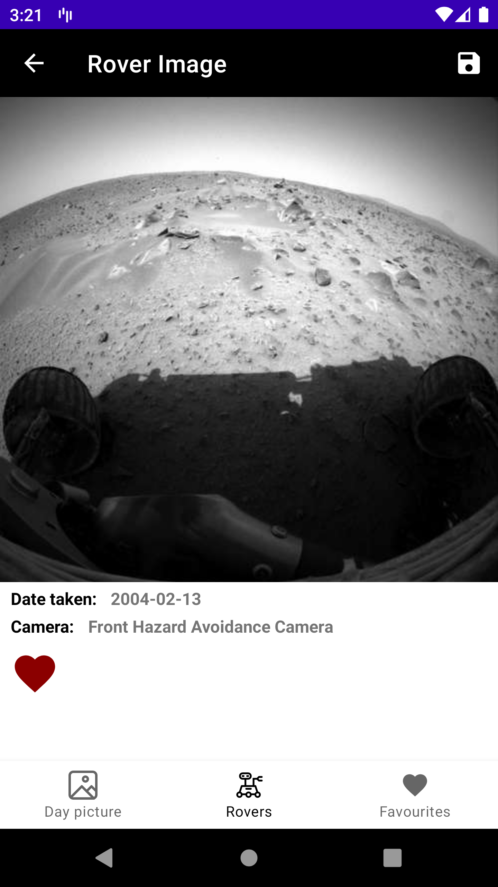
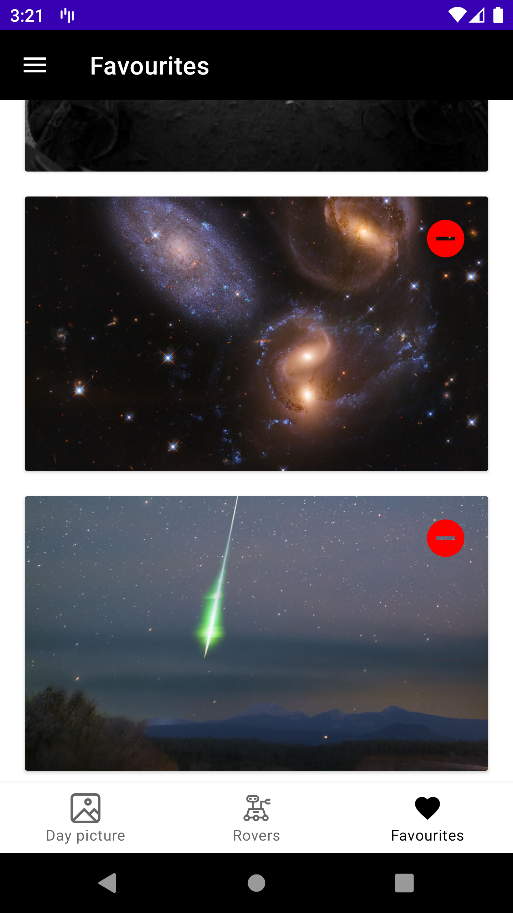
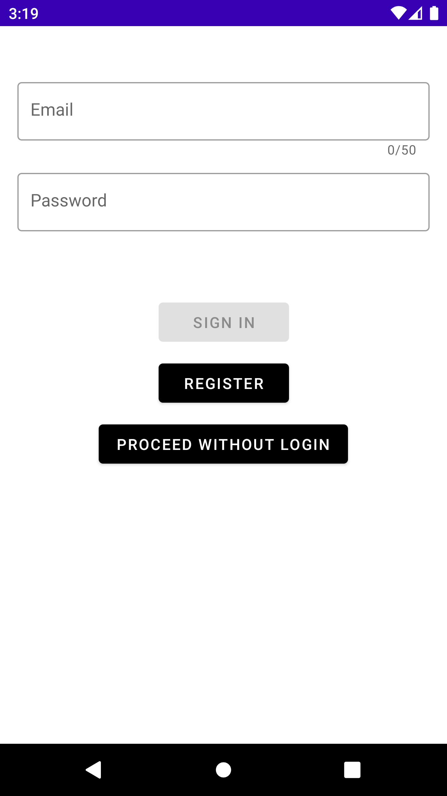
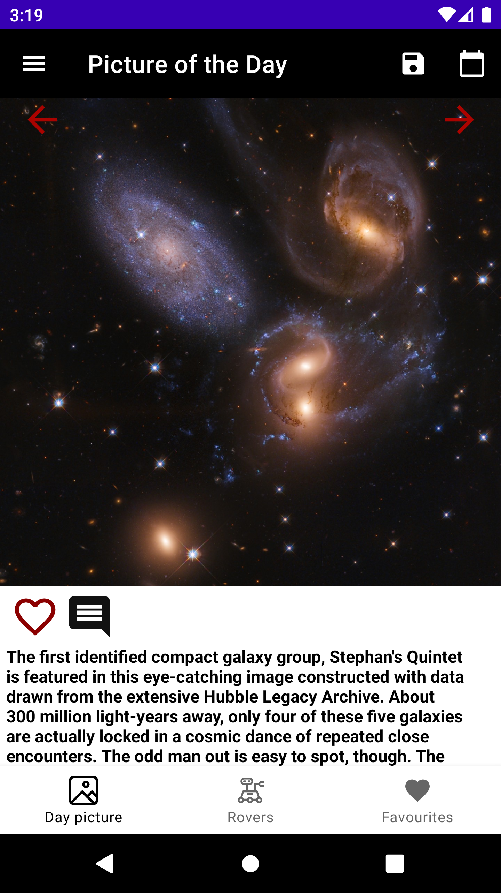
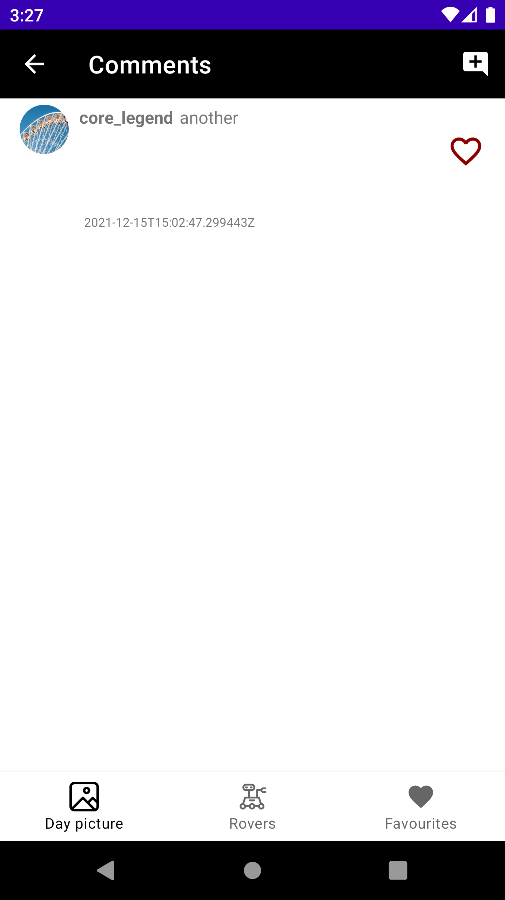
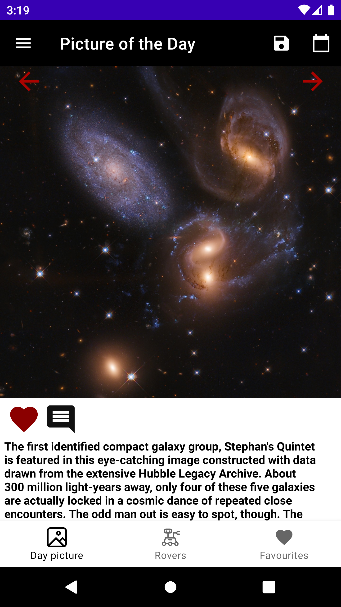

Languages, libraries and tools:
<ul>
<li>Kotlin</li>
<li>Dagger 2 (2.16)</li>
<li>Glide</li>
<li>Retrofit</li>
<li>OKHttp</li>
<li>Gson</li>
<li>Mockito</li>
<li>Espresso</li>
</ul>

<strong><u>Architecture:</u></strong>

MVVM Architecture based on Google guide to App architecture.

  
  
  
  
  
  
  
 

